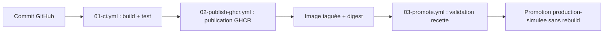

# 02 - Schéma de la chaîne CICD

## Schéma logique

## Explication

Commit GitHub
C'est le déclencheur de tout le système. Dès que vous envoyez une modification de code sur votre dépôt GitHub, l'action est détectée et lance automatiquement la suite de la chaîne.

Workflow 01-ci.yml (Build et Test)
C'est l'étape d'Intégration Continue. Ce script construit l'image Docker sur un serveur temporaire pour vérifier que l'application compile sans erreur. Il démarre ensuite le conteneur et effectue un test automatisé (via la commande curl) pour s'assurer que le site web répond correctement.

Workflow 02-publish-ghcr.yml (Publication GHCR)
C'est l'étape de Livraison Continue. Si et seulement si les tests précédents ont réussi, ce workflow prend le relais pour publier officiellement l'image Docker sur le registre en ligne de GitHub (GitHub Container Registry).

Image taguée et digest
Cette étape crée ce qu'on appelle un artéfact immuable. L'image publiée est figée dans le temps et marquée de manière unique avec un Tag SHA (lié à votre commit) et un Digest SHA256 (l'empreinte numérique exacte du conteneur), garantissant que personne ne pourra la modifier en cours de route.

Workflow 03-promote.yml (Validation recette)
C'est le début du Déploiement Continu. Ce workflow s'active manuellement par un opérateur humain. Il récupère l'image immuable stockée sur le registre pour simuler son installation et sa validation au sein de l'environnement de Recette.

Promotion production-simulee sans rebuild
C'est l'aboutissement du pipeline. Une fois validée en recette, la même image est basculée vers l'environnement de Production simulée. Le point essentiel est qu'il n'y a aucun "rebuild" (aucune re-compilation) : on déploie exactement l'artéfact qui a été testé, éliminant ainsi tout risque de bug surprise.

## Orchestration légère

Le fichier compose.yml décrit un service web et un second service de test. Il sert à documenter et simuler une coordination de conteneurs, sans prétendre remplacer une orchestration de production.

## Limite importante

Docker Compose est utile pour une mise en situation, un test local ou une démonstration de coordination. En production réelle, il faudrait traiter d'autres sujets : haute disponibilité, répartition de charge, supervision, politique de déploiement, rollback, sécurité, sauvegarde et restauration.
