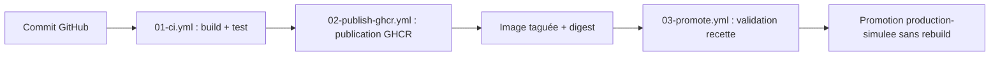

# 02 - Schéma de la chaîne CICD

## Schéma logique

## Explication

Commit GitHub : Déclencheur automatique de toute la chaîne CI/CD dès qu'une modification est poussée sur le dépôt.

01-ci.yml (Build & Test) : Construction de l'image Docker et validation de son bon fonctionnement via un test HTTP (curl) automatisé.

02-publish-ghcr.yml (Publication) : Envoi sécurisé de l'image validée vers le registre de conteneurs GitHub (GHCR).

Artéfact immuable (Tag/Digest) : Figeage définitif de l'image sous une empreinte unique pour garantir son intégrité et sa traçabilité.

03-promote.yml (Recette) : Déclenchement manuel par un opérateur pour tester et valider l'image figée en environnement de Recette.

Promotion Production (Sans rebuild) : Bascule de cette même image testée vers la Production simulée, éliminant tout risque de bug lié à une re-compilation.

## Orchestration légère

Le fichier compose.yml décrit un service web et un second service de test. Il sert à documenter et simuler une coordination de conteneurs, sans prétendre remplacer une orchestration de production.

## Limite importante

Docker Compose est utile pour une mise en situation, un test local ou une démonstration de coordination. En production réelle, il faudrait traiter d'autres sujets : haute disponibilité, répartition de charge, supervision, politique de déploiement, rollback, sécurité, sauvegarde et restauration.
